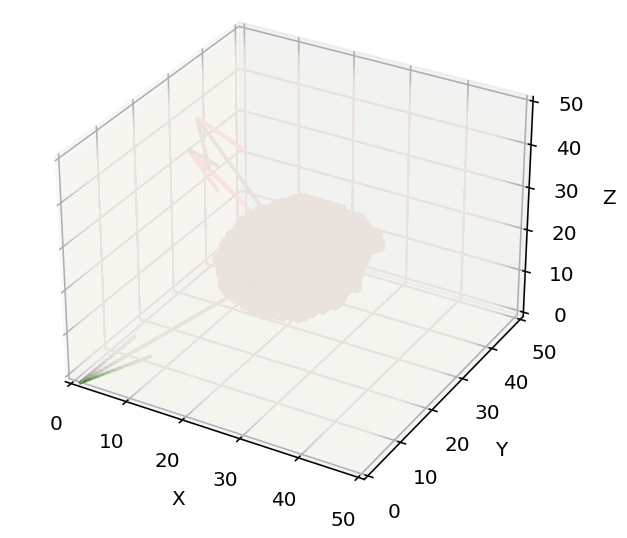
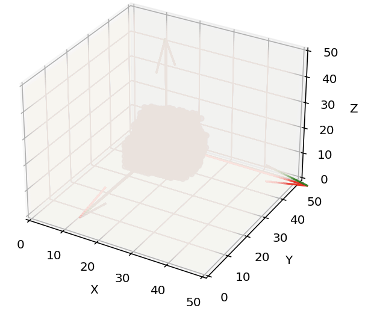

## Normalizing 3D images orientation

The goal of this repository is to provide a simple way to normalize the orientation of 3D voxel images (3D scalar fields). This is achieved by aligning rotation axes of the 3D voxel image with the orthonormal basis (x,y,z). 

This repository includes pytorch & numpy functions to:
 * compute rotation of 3D tensors (i.e. 3D fields, not necessarily scalar fields) [rotation.py](rotation.py)
 * compute inertia parameters of 3D voxel images (3D scalar fields) ([inertia.py](inertia.py))
 * plot 3D images and some inertia parameters ([plot_field.py](plot_field.py))

To normalize the orientation of a 3D numpy array, see [normalize_numpy.ipynb](normalize_numpy.ipynb).

To normalize the orientation of a batch of 3D PyTorch Tensors, see [normalize_torch.ipynb](normalize_torch.ipynb).

To rotate a batch of 3D fields represented by a 5D PyTorch tensor, see [example_pytorch.ipynb](example_pytorch.ipynb).

To rotate a 3D field represented by a 3D numpy array, see [example_numpy.ipynb](example_numpy.ipynb).

Author: [Victor Ludvig](https://www.linkedin.com/in/victor-ludvig-08b29b218/?originalSubdomain=fr), [Centre for Mathematical Morphology (CMM)](https://www.cmm.minesparis.psl.eu/en/home/), Mines Paris, 2022.

 

## Description of the algorithm
Here's an example of a 3D scalar field normalization. The image seems blurred because the alpha channel is leveraged (so as to plot the whole 3D field).
|Before normalization                             |After normalization                       |
| :---:                                           | :---:                                    |
||

Rotation axes, defined as the eigen vectors of the inertia matrix, are aligned with the orthonormal basis (x,y,z).  
The rotation axis with biggest eigen value is aliged with x (red), the second with y (green), and the third with z (gray).  
However, eigen vectors directions are defined modulo pi, thus 3 symetries along x,y and z axes centered around the barycenter of the 3D field are performed, so that the farthest from barycenter non zero voxel is on the increasing part of the axis. Thus, the normalization transformation is unique.  
Sizes of images are not altered. This is particularly important if the dimensions of the 3D images must remain the same, e.g. in a pre-processing phase. 
 
 
## Technical details
Rotations are computed using rotation matrices. Knowing axis of rotation n and angle a, with c = cos(a) and s = sin(a), the corresponding rotation matrix is given by:
$$M = \begin{pmatrix}
c + (1-c)n_1^2& (1-c)n_1n_2+sn_3 & (1-c)n_1n_3-sn_2 \\[0.3em]
(1-c)n_1n_2-sn_3 & c+(1-c)n_2^2 & (1-c)n_2n_3+sn_1 \\[0.3em]
(1-c)n_1n_3+sn_2 & (1-c)n_2n_3-sn_1 & c+(1-c)n_3^2
\end{pmatrix}$$

 For a thorough review of the different representations of rotations, see [Rowenhorst](https://iopscience.iop.org/article/10.1088/0965-0393/23/8/083501/meta).
 
Points are expressed from a reference point called reference in the rotate function. The barycenter is used as a reference for orientation normalization.
 
In order to leverage numpy/pytorch vectorization, 3 functions corresponding to each row of the rotation matrix are defined to compute the (x',y',z') coordinates of the original point (x,y,z). Thus, passing as arguments grids of the 3D space leverages numpy/pytorch vectorization. As an example,
$$F_x(x,y,z) = x' = (c+(1-c)n_1^2)x + ((1-c)n_1n_2+sn_3)y + ((1-c)n_1n_3-sn_2)z$$
 Though calculating directly (x', y', z') knowing (x, y, z) is straightforward, it is prone to approximation errors because of the voxel dicretization. Indeed, as the rotated coordinates (x', y', z') are rounded, some points of the space will not be reached and the 3D image will contain holes. Hence, for each point of the rotated space (x', y', z'), the corresponding initial point (x, y, z) is computed using the inverted rotation matrix. Points (x', y', z') which do not have an antecedent inside of the 3D space will have a default value, which can be set in the rotate function from [rotation.py](rotation.py).

 

## Notes
3D images are plotted using matplotlib, which does not leverage the gpu. Thus, wide 3D images may take a while to be rendered. Consider using a library that leverages the gpu such as [vispy](https://vispy.org/) if you need to render huge 3D images.
